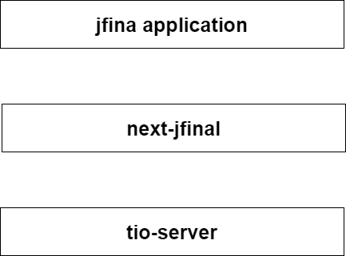

# next jfinal
The next JFinal is JFinal without Servlet.
next-jfinal是下一代jfinal开发框架,和jfinal不同的是next-jfinal移除了servlet.使用tio框架进行底层的io处理,具有更高的性能提升和更好的开发体验

## 目前已经完成的工作如下
- 1.将jfinal移除servlet,命名为next-jfinal
- 2.使用tio重写servet,[源码](https://github.com/litongjava/next-jfinal/tree/main/src/main/java/com/jfinal/servlet),[源码2](https://github.com/litongjava/next-jfinal/tree/main/src/main/java/com/litongjava/tio/boot/servlet)
- 3.使用next-jfinal对接tio
- 4.自定义tio的handler将请求转发到jfinal的Controller
- 5.编写jfinal测试Hello World测试

已经得完成next-jfinal-web-hello[源码](https://github.com/litongjava/java-ee-next-jfinal-study/tree/main/next-jfinal-web-hello-study)

## 目前尚未完整的工作
让自定义的servlet完全适配旧的jfinal,即完全重写servlet或者部分重写servlet以支持旧的jfinal应用

## 框架优势
1. **更快的启动速度**: 因为没有servlet容器,所以启动速非常快,web-hello工程,可以在500毫秒内启动,这对云服务而言极其重要

1. **性能提升**：Tio 提供了基于 AIO 的实现，这相比于传统的基于 Servlet 的阻塞 IO，在处理并发请求时可以有更高的性能。这是因为 AIO 支持单线程或少量线程处理大量连接，减少了线程切换的开销。

2. **更灵活的协议支持**：由于 Tio 提供了更底层的网络通信支持，它可以灵活处理各种自定义协议，而不仅限于 HTTP/HTTPS。这在开发需要支持特定协议的应用时非常有用。

3. **更好的控制与优化空间**：通过直接处理底层的网络通信，开发者可以对网络层有更精细的控制，比如自定义缓冲区大小、连接管理、超时设置等，从而为特定场景进行优化。

4. **降低资源消耗**：由于 AIO 基于非阻塞模型，能够减少对线程和内存的需求，尤其在高并发场景下，能够有效降低资源消耗。

5. **更适合实时通信**：Tio 更适合需要低延迟和高吞吐量的实时通信场景，比如在线游戏、即时通讯等，因为它能够更高效地处理大量的并发连接和数据传输。next-jfinal可以完全集成这一特性

6. **更好的扩展性**：基于 AIO 的框架通常具有更好的扩展性。它们能够更有效地处理增长的用户和数据量，而无需线性地增加硬件资源。

## 架构图

## 流程图
